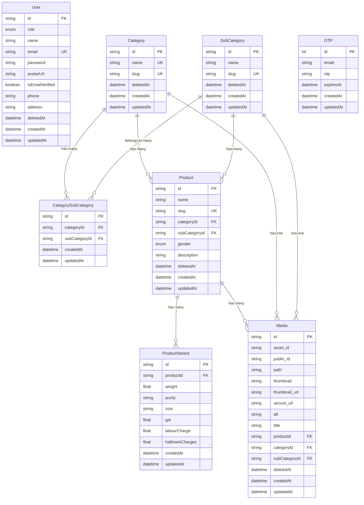

# M K Jewellers - Database Schema Documentation

## Overview
This document explains the database structure for the M K Jewellers e-commerce platform. The database uses MySQL with Prisma ORM.

---

## Entity Relationship Diagram



---

## Database Tables

### 1. **User** (Authentication & User Management)
Stores user account information for both customers and admins.

| Field | Type | Description |
|-------|------|-------------|
| `id` | UUID | Primary key |
| `role` | Enum | `user` or `admin` |
| `name` | String | User's full name |
| `email` | String | Unique email address |
| `password` | String | Hashed password |
| `avatarUrl` | String? | Profile picture URL |
| `isEmailVerified` | Boolean | Email verification status |
| `phone` | String? | Contact number |
| `address` | String? | User address |
| `deletedAt` | DateTime? | Soft delete timestamp |
| `createdAt` | DateTime | Account creation date |
| `updatedAt` | DateTime | Last update date |

---

### 2. **Category** (Product Categories)
Main product categories (e.g., Rings, Necklaces, Bangles).

| Field | Type | Description |
|-------|------|-------------|
| `id` | UUID | Primary key |
| `name` | String | Category name (unique) |
| `slug` | String | URL-friendly name (unique) |
| `deletedAt` | DateTime? | Soft delete timestamp |
| `createdAt` | DateTime | Creation date |
| `updatedAt` | DateTime | Last update date |

**Relationships:**
- Has many `Products`
- Has many `SubCategories` (via junction table)
- Has many `Media` (for category image)

---

### 3. **SubCategory** (Product Subcategories)
Subcategories within categories (e.g., Gold Rings, Silver Rings).

| Field | Type | Description |
|-------|------|-------------|
| `id` | UUID | Primary key |
| `name` | String | Subcategory name |
| `slug` | String | URL-friendly name (unique) |
| `deletedAt` | DateTime? | Soft delete timestamp |
| `createdAt` | DateTime | Creation date |
| `updatedAt` | DateTime | Last update date |

**Relationships:**
- Belongs to many `Categories` (via junction table)
- Has many `Products`
- Has many `Media` (for subcategory image)

---

### 4. **CategorySubCategory** (Junction Table)
Many-to-many relationship between Categories and SubCategories.

| Field | Type | Description |
|-------|------|-------------|
| `id` | UUID | Primary key |
| `categoryId` | UUID | Foreign key to Category |
| `subCategoryId` | UUID | Foreign key to SubCategory |
| `createdAt` | DateTime | Creation date |
| `updatedAt` | DateTime | Last update date |

**Unique Constraint:** `[categoryId, subCategoryId]` - Prevents duplicate relationships

**Example:**
- Category "Rings" can have SubCategories: "Gold Rings", "Silver Rings", "Diamond Rings"
- SubCategory "Gold Rings" can belong to Categories: "Rings", "Wedding Jewelry"

---

### 5. **Product** (Main Product Information)
Stores product details (name, description, category).

| Field | Type | Description |
|-------|------|-------------|
| `id` | UUID | Primary key |
| `name` | String | Product name |
| `slug` | String | URL-friendly name (unique) |
| `categoryId` | UUID | Foreign key to Category |
| `subCategoryId` | UUID | Foreign key to SubCategory |
| `gender` | Enum | `MEN` or `WOMEN` |
| `description` | String | Product description (HTML) |
| `deletedAt` | DateTime? | Soft delete timestamp |
| `createdAt` | DateTime | Creation date |
| `updatedAt` | DateTime | Last update date |

**Relationships:**
- Belongs to one `Category`
- Belongs to one `SubCategory`
- Has many `ProductVariants`
- Has many `Media` (product images)

**Example:**
```
Product: "Gold Chain Necklace"
├── Category: "Necklaces"
├── SubCategory: "Gold Chains"
├── Gender: "WOMEN"
├── Description: "Beautiful 22K gold chain..."
├── Media: [image1.jpg, image2.jpg, image3.jpg]
└── Variants:
    ├── 5g, 22K, ₹25,000
    ├── 10g, 22K, ₹50,000
    └── 15g, 24K, ₹80,000
```

---

### 6. **ProductVariant** (Product Variations)
Different variations of a product (weight, purity, pricing).

| Field | Type | Description |
|-------|------|-------------|
| `id` | UUID | Primary key |
| `productId` | UUID | Foreign key to Product |
| `weight` | Float | Weight in grams |
| `purity` | String | Gold purity (e.g., "22K", "24K") |
| `size` | String? | Size (optional, e.g., ring size) |
| `gst` | Float | GST percentage |
| `labourCharge` | Float | Labour charges |
| `hallmarkCharges` | Float | Hallmark charges |
| `createdAt` | DateTime | Creation date |
| `updatedAt` | DateTime | Last update date |

**Unique Constraint:** `[productId, weight, purity, size]` - Prevents duplicate variants

**Example:**
```
Product: "Gold Ring"
Variants:
├── 5g, 22K, Size 12 → ₹20,000
├── 7g, 22K, Size 14 → ₹28,000
└── 10g, 24K, Size 16 → ₹45,000
```

---

### 7. **Media** (Images & Files)
Stores media files (images) for products, categories, and subcategories.

| Field | Type | Description |
|-------|------|-------------|
| `id` | UUID | Primary key |
| `asset_id` | String | Cloudinary asset ID |
| `public_id` | String | Cloudinary public ID |
| `path` | String | File path |
| `thumbnail` | String? | Thumbnail URL |
| `thumbnail_url` | String | Thumbnail URL |
| `secure_url` | String | HTTPS image URL |
| `alt` | String? | Alt text for SEO |
| `title` | String? | Image title |
| `productId` | UUID? | Foreign key to Product |
| `categoryId` | UUID? | Foreign key to Category |
| `subCategoryId` | UUID? | Foreign key to SubCategory |
| `deletedAt` | DateTime? | Soft delete timestamp |
| `createdAt` | DateTime | Upload date |
| `updatedAt` | DateTime | Last update date |

**Relationships:**
- Can belong to one `Product` (product images)
- Can belong to one `Category` (category image)
- Can belong to one `SubCategory` (subcategory image)

---

### 8. **OTP** (Email Verification)
Temporary one-time passwords for email verification.

| Field | Type | Description |
|-------|------|-------------|
| `id` | Int | Primary key (auto-increment) |
| `email` | String | User email |
| `otp` | String | 6-digit OTP code |
| `expiresAt` | DateTime | Expiration time |
| `createdAt` | DateTime | Creation date |
| `updatedAt` | DateTime | Last update date |

---

## Enums

### **Role**
```
- user (default)
- admin
```

### **Gender**
```
- MEN
- WOMEN
```

---

## Key Relationships Explained

### **Category ↔ SubCategory (Many-to-Many)**
```
Category "Rings"
├── SubCategory "Gold Rings"
├── SubCategory "Silver Rings"
└── SubCategory "Diamond Rings"

SubCategory "Gold Rings"
├── Category "Rings"
└── Category "Wedding Jewelry"
```

### **Product → Variants (One-to-Many)**
```
Product "Gold Chain"
├── Variant 1: 5g, 22K
├── Variant 2: 10g, 22K
└── Variant 3: 15g, 24K
```

### **Product → Media (One-to-Many)**
```
Product "Gold Ring"
├── Image 1 (front view)
├── Image 2 (side view)
└── Image 3 (detail view)
```

---

## Indexes (Performance Optimization)

### **Products Table**
- `idx_products_category_id` - Fast category filtering
- `idx_products_subcategory_id` - Fast subcategory filtering
- `idx_products_deleted_at` - Fast soft delete queries

### **Media Table**
- `idx_medias_product_id` - Fast product image queries
- `idx_medias_category_id` - Fast category image queries
- `idx_medias_subcategory_id` - Fast subcategory image queries

### **ProductVariants Table**
- `idx_product_variants_product_id` - Fast variant lookup
- `idx_product_variants_unique` - Prevent duplicate variants

---

## Soft Delete Pattern

All main tables use `deletedAt` field for soft deletes:
- `null` = Active record
- `DateTime` = Deleted record (hidden from queries)

**Benefits:**
- Data recovery possible
- Maintains referential integrity
- Audit trail

---

## Example Data Flow

### **Creating a Product:**
```
1. Admin creates Product:
   - Name: "Gold Chain Necklace"
   - Category: "Necklaces"
   - SubCategory: "Gold Chains"
   - Gender: "WOMEN"
   - Description: "Beautiful 22K gold chain..."

2. Admin uploads 3 images → Media table

3. Admin adds variants:
   - 5g, 22K → ProductVariant
   - 10g, 22K → ProductVariant
   - 15g, 24K → ProductVariant

4. Database structure:
   Product (1 record)
   ├── Media (3 records)
   └── ProductVariant (3 records)
```

### **Customer Browsing:**
```
1. Customer visits homepage
   → Fetch Categories (with Media)

2. Customer clicks "Necklaces"
   → Fetch SubCategories for "Necklaces"

3. Customer clicks "Gold Chains"
   → Fetch Products where subCategoryId = "Gold Chains"
   → Include first Media for each Product

4. Customer clicks product
   → Fetch Product with all Media and all Variants
```

---

## Technology Stack

- **Database:** MySQL
- **ORM:** Prisma
- **Primary Keys:** UUID (except OTP)
- **Timestamps:** Automatic `createdAt` and `updatedAt`
- **Soft Deletes:** `deletedAt` field
- **Image Storage:** Cloudinary

---

## Notes for Developers

1. **Always use soft deletes** - Set `deletedAt` instead of actual deletion
2. **Use indexes** - All foreign keys are indexed for performance
3. **Unique constraints** - Prevent duplicate data (slugs, emails, variants)
4. **Cascade deletes** - ProductVariants deleted when Product is deleted
5. **Nullable relations** - Media can exist without being attached to products
