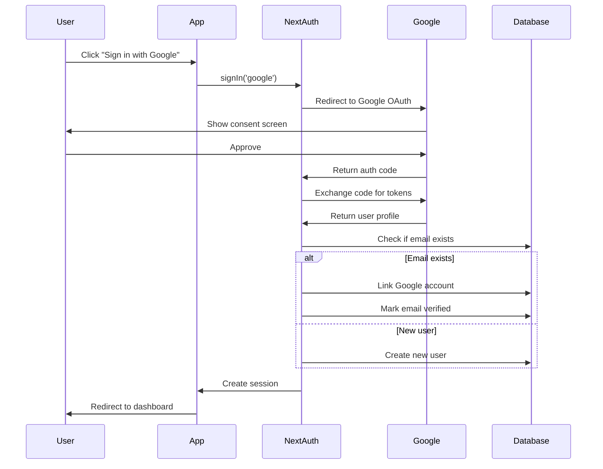
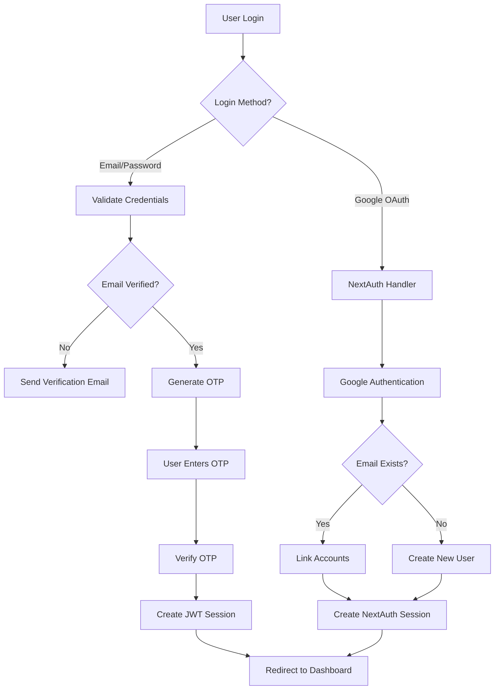

# Google OAuth Integration Plan (Industry Standard)

A comprehensive guide to integrate Google OAuth authentication alongside your existing email/password system, using **unified NextAuth session management** for both methods.

---

## 🎯 Goals

1. **Add Google OAuth** as an alternative login method
2. **Prevent duplicate accounts** for the same email (automatic linking)
3. **Maintain existing authentication** logic (email/password + OTP)
4. **Unified token system** - Single NextAuth session for both methods
5. **Skip OTP verification** for Google OAuth users

---

## 🔍 Current System Analysis

### Existing Authentication Flow
- **Email/Password** → Email Verification → OTP Verification → Custom JWT → Login
- User model has: `email`, `password`, `isEmailVerified`
- JWT-based sessions with HTTP-only cookies (`access_token`)
- Custom backend using Prisma + MySQL

### Key Changes: Unified Session Management

**Before (Current):**
```
Email/Password → Custom JWT → Cookie: access_token
```

**After (Industry Standard):**
```
Email/Password → Custom Validation → NextAuth Session → Cookie: next-auth.session-token
Google OAuth → NextAuth Validation → NextAuth Session → Cookie: next-auth.session-token
```

**Benefits:**
- ✅ Single token system (no duplication)
- ✅ Same logout logic for both methods
- ✅ Simpler middleware
- ✅ Industry-standard security
- ✅ Better maintainability

---

## ✅ Approved Approach

> [!NOTE]
> **Account Linking Strategy: AUTOMATIC (Option A)**
> 
> When a user signs in with Google using an email that already exists:
> - ✅ Automatically link Google account to existing user
> - ✅ User can login with either method
> - ✅ Email verified by Google (trusted provider)
> - ✅ Same session token regardless of login method
> 
> **This is the industry-standard approach used by GitHub, Notion, Vercel, and others.**

> [!IMPORTANT]
> **Token Strategy: UNIFIED (Single NextAuth Session)**
> 
> Both authentication methods will create the **same type of session**:
> - Email/Password flow → Validates credentials → Creates NextAuth session
> - Google OAuth flow → Validates with Google → Creates NextAuth session
> 
> **Result**: No token duplication, simplified session management

> [!WARNING]
> **Password Field Changes**
> 
> The `password` field in the User model must become **optional** for Google OAuth users.
> 
> Migration required:
> - Change `password String` → `password String?`
> - Allow NULL values for OAuth-only users
> 
> **Impact**: Update code that assumes password exists (login validation, password reset)

---

## Proposed Changes

### Database Layer

#### [MODIFY] [schema.prisma](file:///d:/WEB%20DEV/m_k_jewellers/prisma/schema.prisma)

**Changes to User model:**
```prisma
model User {
  id              String    @id @default(uuid())
  role            Role      @default(user)
  name            String
  email           String    @unique
  password        String?   // ✅ Made optional for OAuth users
  avatarUrl       String?
  avatarPublicId  String?
  isEmailVerified Boolean   @default(false)
  emailVerified   DateTime? // ✅ NextAuth compatibility
  phone           String?
  address         String?
  panCard         String?
  deletedAt       DateTime? @db.Timestamp(6)
  createdAt       DateTime  @default(now())
  updatedAt       DateTime  @updatedAt

  // Relations
  orders          Order[]
  accounts        Account[] // ✅ OAuth accounts
  sessions        Session[] // ✅ NextAuth sessions

  @@map("user")
}
```

**New Account model (for OAuth providers):**
```prisma
model Account {
  id                String  @id @default(uuid())
  userId            String
  type              String  // "oauth"
  provider          String  // "google"
  providerAccountId String  // Google user ID
  refresh_token     String? @db.Text
  access_token      String? @db.Text
  expires_at        Int?
  token_type        String?
  scope             String?
  id_token          String? @db.Text
  session_state     String?

  user User @relation(fields: [userId], references: [id], onDelete: Cascade)

  @@unique([provider, providerAccountId])
  @@map("accounts")
}
```

**New Session model (optional - for database sessions):**
```prisma
model Session {
  id           String   @id @default(uuid())
  sessionToken String   @unique
  userId       String
  expires      DateTime
  user         User     @relation(fields: [userId], references: [id], onDelete: Cascade)

  @@map("sessions")
}
```

---

### Authentication Layer

#### [NEW] [auth.config.js](file:///d:/WEB%20DEV/m_k_jewellers/lib/auth.config.js)

NextAuth.js configuration with **Google provider** and **Credentials provider** for unified session management:

```javascript
import GoogleProvider from "next-auth/providers/google"
import CredentialsProvider from "next-auth/providers/credentials"
import { PrismaAdapter } from "@auth/prisma-adapter"
import prisma from "./prisma"

export const authOptions = {
  adapter: PrismaAdapter(prisma),
  
  providers: [
    // Google OAuth Provider
    GoogleProvider({
      clientId: process.env.GOOGLE_CLIENT_ID,
      clientSecret: process.env.GOOGLE_CLIENT_SECRET,
      
      authorization: {
        params: {
          prompt: "consent",
          access_type: "offline",
          response_type: "code"
        }
      }
    }),

    // ✨ Credentials Provider for Email/Password + OTP
    // This bridges your custom auth logic with NextAuth sessions
    CredentialsProvider({
      id: 'credentials',
      name: 'Email and Password',
      credentials: {
        email: { label: "Email", type: "email" },
        userId: { label: "User ID", type: "text" }
      },
      
      // This is called AFTER OTP verification succeeds
      async authorize(credentials) {
        if (!credentials?.userId || !credentials?.email) {
          return null
        }

        // Fetch user from database
        const user = await prisma.user.findUnique({
          where: { id: credentials.userId }
        })

        if (!user || user.email !== credentials.email) {
          return null
        }

        // Return user object (will be added to session)
        return {
          id: user.id,
          email: user.email,
          name: user.name,
          role: user.role,
          isEmailVerified: user.isEmailVerified
        }
      }
    })
  ],

  callbacks: {
    // Called when user signs in
    async signIn({ user, account, profile }) {
      if (account?.provider === "google") {
        // Check if user exists with this email
        const existingUser = await prisma.user.findUnique({
          where: { email: user.email },
          include: { accounts: true }
        })

        if (existingUser) {
          // ✅ AUTOMATIC ACCOUNT LINKING
          const googleAccount = existingUser.accounts.find(
            acc => acc.provider === "google"
          )

          if (!googleAccount) {
            // Link Google account to existing user
            await prisma.account.create({
              data: {
                userId: existingUser.id,
                type: account.type,
                provider: account.provider,
                providerAccountId: account.providerAccountId,
                access_token: account.access_token,
                refresh_token: account.refresh_token,
                expires_at: account.expires_at,
                token_type: account.token_type,
                scope: account.scope,
                id_token: account.id_token
              }
            })
          }

          // Mark email as verified (Google verifies emails)
          if (!existingUser.isEmailVerified) {
            await prisma.user.update({
              where: { id: existingUser.id },
              data: { 
                isEmailVerified: true,
                emailVerified: new Date()
              }
            })
          }
        }
      }

      return true // Allow sign in
    },

    // Customize JWT token
    async jwt({ token, user, account }) {
      if (user) {
        token.id = user.id
        token.role = user.role
        token.isEmailVerified = user.isEmailVerified
      }
      return token
    },

    // Customize session object (same for both providers)
    async session({ session, token }) {
      if (token) {
        session.user.id = token.id
        session.user.role = token.role
        session.user.isEmailVerified = token.isEmailVerified
      }
      return session
    }
  },

  pages: {
    signIn: '/auth/login',
    error: '/auth/error',
  },

  session: {
    strategy: "jwt", // ✅ Unified JWT strategy
    maxAge: 24 * 60 * 60, // 24 hours
  },

  secret: process.env.NEXTAUTH_SECRET,
}
```

---

#### [NEW] [app/api/auth/[...nextauth]/route.js](file:///d:/WEB%20DEV/m_k_jewellers/app/api/auth/[...nextauth]/route.js)

NextAuth API route handler:

```javascript
import NextAuth from "next-auth"
import { authOptions } from "@/lib/auth.config"

const handler = NextAuth(authOptions)

export { handler as GET, handler as POST }
```

---

### UI Layer

#### [MODIFY] [app/(root)/auth/login/page.jsx](file:///d:/WEB%20DEV/m_k_jewellers/app/(root)/auth/login/page.jsx)

**Key Changes:**
1. Add Google Sign-In button
2. After OTP verification, create NextAuth session

```jsx
"use client"
import { signIn } from "next-auth/react"
import { FcGoogle } from "react-icons/fc"
// ... other imports

const page = () => {
  const searchParams = useSearchParams()
  const router = useRouter()
  const [loading, setLoading] = useState(false)
  const [googleLoading, setGoogleLoading] = useState(false)
  const [otpVerificationLoading, setOtpVerificationLoading] = useState(false)
  const [otpEmail, setOtpEmail] = useState()

  // ... existing form setup

  // Email/Password login (sends OTP)
  const onLoginSubmit = async (values) => {
    try {
      setLoading(true)
      const { data: loginResponse } = await axios.post('/api/auth/login', values)

      if (!loginResponse.success) {
        throw new Error(loginResponse.message)
      }

      setOtpEmail(values.email)
      form.reset()
      showToast('success', loginResponse.message)
    } catch (error) {
      const errorMessage = error.response?.data?.message || error.message
      showToast('error', errorMessage)
    } finally {
      setLoading(false)
    }
  }

  // ✨ OTP verification - creates NextAuth session
  const handleOtpVerification = async (values) => {
    try {
      setOtpVerificationLoading(true)
      
      // Verify OTP with your backend
      const { data: otpResponse } = await axios.post('/api/auth/verify-otp', values)

      if (!otpResponse.success) {
        throw new Error(otpResponse.message)
      }

      // ✨ Create NextAuth session using Credentials Provider
      const result = await signIn('credentials', {
        userId: otpResponse.data.id,
        email: otpResponse.data.email,
        redirect: false
      })

      if (result?.error) {
        throw new Error('Failed to create session')
      }

      setOtpEmail()
      showToast('success', 'Login successful!')

      // Redirect based on role or callback
      const callbackUrl = searchParams.get('callback')
      if (callbackUrl) {
        router.push(callbackUrl)
      } else {
        otpResponse.data.role === 'admin' 
          ? router.push(ADMIN_DASHBOARD) 
          : router.push(USER_DASHBOARD)
      }
    } catch (error) {
      const errorMessage = error.response?.data?.message || error.message
      showToast('error', errorMessage)
    } finally {
      setOtpVerificationLoading(false)
    }
  }

  // ✨ Google OAuth login
  const handleGoogleSignIn = async () => {
    try {
      setGoogleLoading(true)
      const callbackUrl = searchParams.get('callback') || USER_DASHBOARD
      
      await signIn('google', { 
        callbackUrl,
        redirect: true // NextAuth handles redirect
      })
    } catch (error) {
      showToast('error', 'Failed to sign in with Google')
      setGoogleLoading(false)
    }
  }

  return (
    <div className="w-full px-4 sm:px-0">
      <Card className='w-full max-w-[450px] mx-auto'>
        <CardHeader className="flex flex-col items-center">
          {/* ... existing header ... */}
        </CardHeader>

        {!otpEmail ? (
          <>
            <CardContent>
              <Form {...form}>
                <form onSubmit={form.handleSubmit(onLoginSubmit)}>
                  {/* ... existing email/password fields ... */}
                  
                  <div className='mt-5'>
                    <ButtonLoading 
                      text='Login' 
                      type='submit' 
                      loading={loading} 
                      className='w-full cursor-pointer' 
                    />
                  </div>
                </form>
              </Form>

              {/* ✨ Divider */}
              <div className="relative my-6">
                <div className="absolute inset-0 flex items-center">
                  <span className="w-full border-t" />
                </div>
                <div className="relative flex justify-center text-xs uppercase">
                  <span className="bg-background px-2 text-muted-foreground">
                    Or continue with
                  </span>
                </div>
              </div>

              {/* ✨ Google Sign-In Button */}
              <Button
                type="button"
                variant="outline"
                className="w-full"
                onClick={handleGoogleSignIn}
                disabled={googleLoading}
              >
                <FcGoogle className="mr-2 h-5 w-5" />
                {googleLoading ? 'Signing in...' : 'Sign in with Google'}
              </Button>
            </CardContent>

            <CardFooter>
              {/* ... existing footer links ... */}
            </CardFooter>
          </>
        ) : (
          <OTPVerification 
            email={otpEmail} 
            onSubmit={handleOtpVerification} 
            loading={otpVerificationLoading} 
          />
        )}
      </Card>
    </div>
  )
}

export default page
```

**Required imports:**
```jsx
import { signIn } from "next-auth/react"
import { FcGoogle } from "react-icons/fc"
import { Button } from "@/components/ui/button"
```

---

#### [MODIFY] [app/(root)/auth/register/page.jsx](file:///d:/WEB%20DEV/m_k_jewellers/app/(root)/auth/register/page.jsx)

Add Google Sign-Up button (same pattern):

```jsx
"use client"
import { signIn } from "next-auth/react"
import { FcGoogle } from "react-icons/fc"
import { Button } from "@/components/ui/button"

const page = () => {
  const [googleLoading, setGoogleLoading] = useState(false)

  const handleGoogleSignUp = async () => {
    try {
      setGoogleLoading(true)
      await signIn('google', { 
        callbackUrl: USER_DASHBOARD,
        redirect: true
      })
    } catch (error) {
      showToast('error', 'Failed to sign up with Google')
      setGoogleLoading(false)
    }
  }

  return (
    <div className="w-full px-4 sm:px-0 overflow-x-hidden">
      <Card className='w-full max-w-[450px] mx-auto'>
        {/* ... existing form ... */}

        <CardContent>
          <Form {...form}>
            {/* ... existing registration form ... */}
          </Form>

          {/* ✨ Add divider and Google button */}
          <div className="relative my-6">
            <div className="absolute inset-0 flex items-center">
              <span className="w-full border-t" />
            </div>
            <div className="relative flex justify-center text-xs uppercase">
              <span className="bg-background px-2 text-muted-foreground">
                Or continue with
              </span>
            </div>
          </div>

          <Button
            type="button"
            variant="outline"
            className="w-full"
            onClick={handleGoogleSignUp}
            disabled={googleLoading}
          >
            <FcGoogle className="mr-2 h-5 w-5" />
            {googleLoading ? 'Signing up...' : 'Sign up with Google'}
          </Button>
        </CardContent>

        {/* ... existing footer ... */}
      </Card>
    </div>
  )
}
```

---

#### [NEW] [app/providers.jsx](file:///d:/WEB%20DEV/m_k_jewellers/app/providers.jsx)

Wrap app with NextAuth SessionProvider:

```jsx
"use client"
import { SessionProvider } from "next-auth/react"

export function Providers({ children, session }) {
  return (
    <SessionProvider session={session}>
      {children}
    </SessionProvider>
  )
}
```

#### [MODIFY] [app/layout.jsx](file:///d:/WEB%20DEV/m_k_jewellers/app/layout.jsx)

Add SessionProvider to root layout:

```jsx
import { Providers } from "./providers"

export default function RootLayout({ children }) {
  return (
    <html lang="en">
      <body>
        <Providers>
          {children}
        </Providers>
      </body>
    </html>
  )
}
```

---

### Updated API Routes

#### [MODIFY] [app/api/auth/verify-otp/route.js](file:///d:/WEB%20DEV/m_k_jewellers/app/api/auth/verify-otp/route.js)

**Key Change**: After OTP verification, create NextAuth session instead of custom JWT:

```javascript
import { catchError, response } from "@/lib/helperFunction"
import { deleteOTPByEmail, verifyOTP } from "@/lib/otp.service"
import { findUserByEmail } from "@/lib/user.service"
import { zSchema } from "@/lib/zodSchema"

export async function POST(request) {
  try {
    const payload = await request.json()

    const validationSchema = zSchema.pick({
      otp: true, email: true
    })

    const validatedData = validationSchema.safeParse(payload)
    if (!validatedData.success) {
      return response(false, 401, "Invalid or Missing Data", validatedData.error)
    }

    const { email, otp } = validatedData.data

    // Verify OTP
    const getOtpData = await verifyOTP(email, otp)
    if (!getOtpData.success) {
      return response(false, 404, 'Invalid or expired OTP')
    }

    // Get user
    const getUser = await findUserByEmail(email)
    if (!getUser) {
      return response(false, 404, 'User not found')
    }

    // Delete OTP
    await deleteOTPByEmail(email)

    // ✨ Return user data for NextAuth Credentials Provider
    // The frontend will call signIn('credentials', { userId, email })
    return response(true, 200, "OTP verified successfully", {
      id: getUser.id,
      role: getUser.role,
      name: getUser.name,
      email: getUser.email,
      phone: getUser.phone,
      address: getUser.address,
      avatarUrl: getUser.avatarUrl,
    })

  } catch (error) {
    return catchError(error)
  }
}
```

---

### Middleware & Session Management

#### [NEW] [middleware.js](file:///d:/WEB%20DEV/m_k_jewellers/middleware.js)

Unified middleware for both authentication methods:

```javascript
export { default } from "next-auth/middleware"

export const config = {
  matcher: [
    '/admin/:path*',
    '/my-account/:path*',
    '/checkout/:path*'
  ]
}
```

**Advanced version with custom logic:**

```javascript
import { withAuth } from "next-auth/middleware"
import { NextResponse } from "next/server"

export default withAuth(
  function middleware(req) {
    const token = req.nextauth.token
    const path = req.nextUrl.pathname

    // Admin-only routes
    if (path.startsWith('/admin') && token?.role !== 'admin') {
      return NextResponse.redirect(new URL('/auth/login', req.url))
    }

    // User routes
    if (path.startsWith('/my-account') && !token) {
      return NextResponse.redirect(new URL('/auth/login', req.url))
    }

    return NextResponse.next()
  },
  {
    callbacks: {
      authorized: ({ token }) => !!token
    },
  }
)

export const config = {
  matcher: [
    '/admin/:path*',
    '/my-account/:path*',
    '/checkout/:path*'
  ]
}
```

---

#### [NEW] [lib/auth.helper.js](file:///d:/WEB%20DEV/m_k_jewellers/lib/auth.helper.js)

Helper functions for server-side session access:

```javascript
import { getServerSession } from "next-auth"
import { authOptions } from "./auth.config"

/**
 * Get current user session (unified for both auth methods)
 */
export async function getCurrentUser() {
  const session = await getServerSession(authOptions)
  
  if (!session?.user) {
    return null
  }

  return {
    id: session.user.id,
    email: session.user.email,
    name: session.user.name,
    role: session.user.role,
    isEmailVerified: session.user.isEmailVerified
  }
}

/**
 * Require authentication (throw error if not authenticated)
 */
export async function requireAuth() {
  const user = await getCurrentUser()
  
  if (!user) {
    throw new Error('Unauthorized')
  }
  
  return user
}

/**
 * Require admin role
 */
export async function requireAdmin() {
  const user = await requireAuth()
  
  if (user.role !== 'admin') {
    throw new Error('Forbidden: Admin access required')
  }
  
  return user
}
```

**Usage in API routes:**

```javascript
// app/api/admin/some-route/route.js
import { requireAdmin } from "@/lib/auth.helper"

export async function GET(request) {
  try {
    const user = await requireAdmin()
    
    // Admin-only logic here
    return Response.json({ success: true })
  } catch (error) {
    return Response.json(
      { success: false, message: error.message },
      { status: 401 }
    )
  }
}
```

---

### Service Layer Updates

#### [MODIFY] [lib/user.service.js](file:///d:/WEB%20DEV/m_k_jewellers/lib/user.service.js)

Update to handle optional password:

```javascript
// Update createUser to make password optional
export async function createUser(data) {
  const userData = {
    name: data.name,
    email: data.email,
    role: data.role || "user",
    isEmailVerified: data.isEmailVerified || false,
  }

  // Only hash password if provided
  if (data.password) {
    userData.password = await bcrypt.hash(data.password, 10)
  }

  return prisma.user.create({
    data: userData,
  })
}

// Update loginUser to handle OAuth users
export async function loginUser(email) {
  const getUser = await prisma.user.findFirst({
    where: {
      deletedAt: null,
      email: email,
    },
    select: {
      id: true,
      email: true,
      password: true,
      isEmailVerified: true,
      role: true,
      accounts: true, // ✅ Include linked accounts
    },
  })

  if (!getUser) {
    return null
  }

  return getUser
}
```

---

### Environment Variables

#### [MODIFY] [.env.local](file:///d:/WEB%20DEV/m_k_jewellers/.env.local)

Add new environment variables:

```env
# NextAuth Configuration
NEXTAUTH_URL=http://localhost:3000
NEXTAUTH_SECRET=your-super-secret-key-here-min-32-chars

# Google OAuth Credentials
GOOGLE_CLIENT_ID=your-google-client-id.apps.googleusercontent.com
GOOGLE_CLIENT_SECRET=your-google-client-secret
```

---

## 📦 Dependencies

Install required packages:

```bash
npm install next-auth@latest @auth/prisma-adapter
```

---

## 🔄 Migration Strategy

### Step 1: Database Migration
```bash
npx prisma migrate dev --name add_oauth_support
```

### Step 2: Update Existing Users
All existing users will have `password` field populated, so no data migration needed.

### Step 3: Test Account Linking
1. Create user with email/password
2. Try signing in with Google using same email
3. Verify accounts are linked
4. Test login with both methods

---

## 🧪 Verification Plan

### Automated Tests

**Test Scenarios:**
1. ✅ New user signs up with Google → Creates account with no password
2. ✅ Existing email/password user signs in with Google → Links accounts
3. ✅ User with linked account can login with both methods
4. ✅ Google OAuth users skip OTP verification
5. ✅ Email/password users still require OTP
6. ✅ Session management works for both auth types

### Manual Verification

1. **Test Google OAuth Flow**
   - Click "Sign in with Google"
   - Verify redirect to Google
   - Verify successful login and redirect

2. **Test Account Linking**
   - Register with email/password
   - Login with Google using same email
   - Verify both methods work

3. **Test Role-Based Redirect**
   - Admin user → Admin Dashboard
   - Regular user → User Dashboard

---

## 📚 How It Works (Step-by-Step)

### Google OAuth Flow



### Dual Authentication System



---

## 🚀 Implementation Steps

### Phase 1: Database Setup (30 mins)
1. Update Prisma schema
2. Run migration
3. Verify database changes

### Phase 2: NextAuth Configuration (45 mins)
1. Install dependencies
2. Create auth config
3. Set up API routes
4. Add environment variables
5. Get Google OAuth credentials

### Phase 3: UI Integration (30 mins)
1. Add Google button to login page
2. Add Google button to register page
3. Test OAuth flow

### Phase 4: Account Linking (45 mins)
1. Implement signIn callback
2. Test account linking
3. Handle edge cases

### Phase 5: Testing & Refinement (60 mins)
1. Test all scenarios
2. Fix bugs
3. Update documentation

**Total Estimated Time: 3-4 hours**

---

## 🎓 Learning Resources

- [NextAuth.js Documentation](https://next-auth.js.org/)
- [Google OAuth Setup Guide](https://next-auth.js.org/providers/google)
- [Prisma Adapter](https://authjs.dev/reference/adapter/prisma)

---

## ⚠️ Important Notes

1. **Password Field**: Now optional - update all code that assumes password exists
2. **Session Strategy**: Using JWT for both auth methods for consistency
3. **Email Verification**: Google OAuth users auto-verified
4. **Account Linking**: Automatic linking for same email addresses
5. **Backward Compatibility**: Existing email/password flow unchanged

